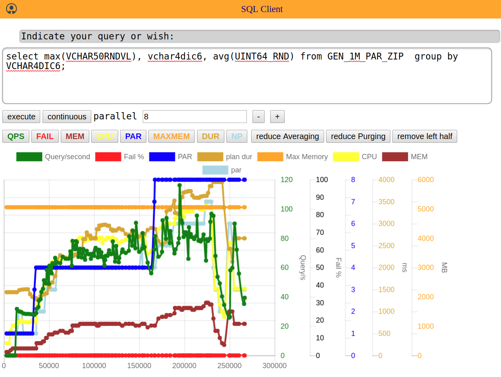

# jdbcsql_web_client
[](https://travis-ci.org/jfseb/jdbcsql_web_client)[](https://coveralls.io/github/jfseb/jdbcsql_web_client)

Web server and client to execute sql queries via node-jdbc

node-jdbc connects a JVM to node, allows do load an arbitrary JDBC
SQL Driver etc.

Driver and classpath can be configured via a jdbcsql_config.json file
in the root folder. If none is provided.

## Built commandline

```
    npm install
    gulp
```

prerequisites:
the dependency node-jdbc require java and jdk (javac) on your path

### Run server:

```
    node server.js
```

```
    node server.js --simul
```
Simulates a database (no jdbc driver and running db requried)

```
    node server.js -f
```
Creates a fake system view table on any DB and uses this to emulate a monitoring view

## Usage

For plain usage without forking and tampering, it is sufficient to create
an independent project (npm init),
include this as a dependency  npm i jdbcsql_web_client --save-dev
and create a small main.js:
```javascript
var server = require('jdbcsql_web_client');
```
put a config next to main and
run via
```
node main.js --help
```
# example screenshot



## Development

The src folder contains both typescript and js files.

All files are compiled to gen  (using tsc/babel)

tap for testing and coverage

Currently the test folder is not compiled, but contains directly es6 modules

gulp, gulp-watch should work


